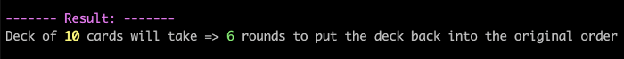
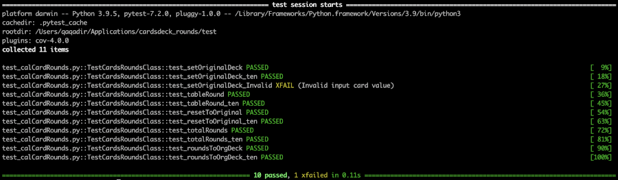

# cardsdeck_rounds

## Setup
Clone the repo locally, following will be the directory structure
```
|__cardsdeck_rounds
├── README.md
├── cardRounds
│   ├── __init__.py
│   └── calCardRounds.py
└── test
    ├── __init__.py
    └── test_calCardRounds.py
```

## Execute the script

Open the Terminal application. Navigate to the folder **cardsdeck_rounds/cardRounds/** run the following command to execute the script. Pass the **arg** value for the **"card deck size"**, e.g.: 10

```shell
$ ./calCardRounds.py 10
```

**Following is the output (result):**



## Execute the test using pytest

Open the Terminal application. Navigate to the folder **/cardsdeck_rounds/test/** run the following command to execute the test.

```shell
$ python3 -m pytest -v

or 

$ pytest
```

**Following is the test results:**



In the **/cardsdeck_rounds/test/test_calCardRounds.py** file, the test are based on following:
```python
1. By passing the variable
input_deck_size = 7

and

2. By passing the value of card deck size 10

```

